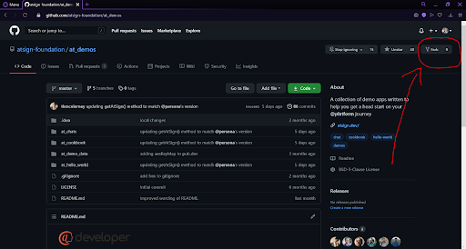
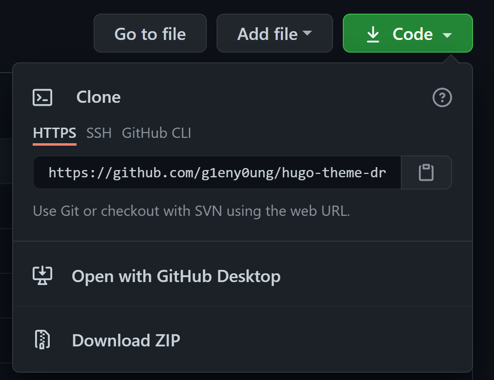
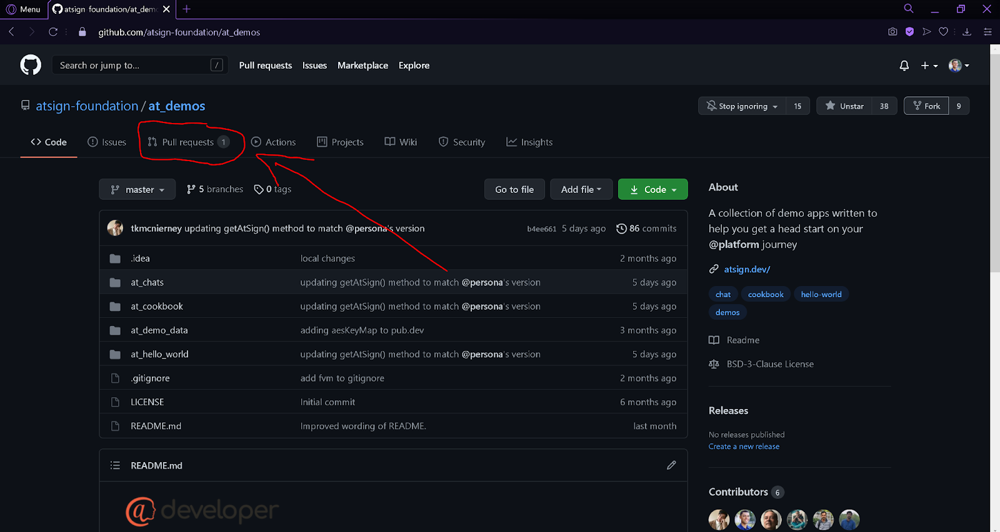
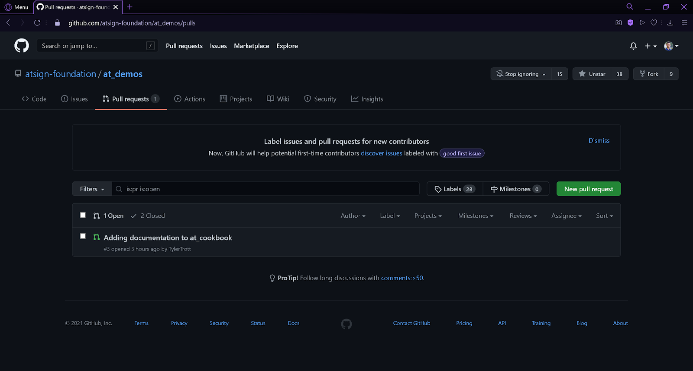
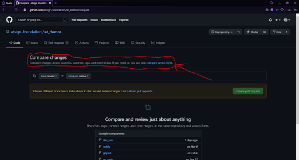

# Contributing to an Open-Source GitHub Project

## Overview:

There are a countless number of open source projects that exist on the Internet, but just how are you meant to add anything to these? What does forking a repository mean? What is a pull request? How can you make a contribution?

## What is an open source project?

For anyone who is new to not just software development but project management in general, an open source project is that of which any person has access to all of the details of the project and are free to utilize it, use it for research purposes, make modifications to it, and even distribute it elsewhere. GitHub of course, being one of the main wellsprings of open source projects! For the sake of this article, I will be using [The @ Company’s atsign-foundation ](https://github.com/atsign-foundation) repository to explain any examples.

## Why would you want to contribute to an open source project?

With the new, blossoming field of data science, being capable of finding your way around a GitHub project is a significantly useful skill in today’s world. You’ll find that many corporate entities will highlight your contributions to any GitHub project (as long as you have listed them within your résumé!). You’ll also find that there are many friendly developers who really appreciate the people who add modifications to the project, and especially if that modification comes with a flagged issue (there seems to be a special place in the heart of a developer for people who raise issues within their code)! There’s also this sense of great accomplishment when you can add something useful to a project, more importantly, for the projects that you use often.

## How can you contribute to an open source project?

### Choosing a Project:

The first step in contributing something to a project is knowing what project you will contribute to! I’d personally recommend thinking about a project or an idea you have familiarity with as this will greatly assist in understanding what the project’s purpose is.

## Forking a Repository:

What is forking? In simplest terms, forking a project is simply making a copy of it to your own GitHub profile. GitHub allows anyone to fork a repository and this will allow you to do whatever you please with the entire repository without making any actual changes to the real project! Imagine it as taking a picture of a tree. You can make edits to your photo to make the tree look purple or to give it a face, but you won’t make any changes to the actual tree!

### How to Fork a Repository:

First, navigate to the home page of the repository you wish to fork. Refer to the screenshot below:

Here, you can see that I am currently within the atsign-foundation’s ‘[at_demos](https://github.com/atsign-foundation/at_demos)’ repository.



If you look at the top right corner of the repository’s page, you’ll notice the ‘Fork’ button and a number next to it. That number represents the number of times this specific repository has been forked. Once you select the Fork button, GitHub will prompt you which repository you wish to fork to. My go-to option is typically my own profile, where it will create an entire repository under your profile name so that you may make whatever modifications you wish. After you choose what location you wish to fork to, GitHub will do all of the hard work for you. After a few seconds or so (depending on your Internet connection speed), you’ll find that the entire repository that you forked, is now copied to wherever you told GitHub to fork it! Congratulations! You’ve forked a repository!

### Make Modifications to the Repository:

Now, you can do whatever your heart so desires with the project! Depending on what the project is, you may wish to clone the repository to your local machine using https/, or simply commit changes directly on your forked repository (totally your choice/preference!).

### Creating a Public Key with GitHub

We recommend git cloning the repository using the SSH key option. You can set up your own public keys on GitHub quite easily. If you see below, you will see the Clone options, 'HTTPS, SSH, and GitHub CLI'. Select the 'SSH' option and this will provide you a password-protected SSH key to git clone the repository.



In order to create a public key on your machine, open any UNIX terminal and type the command:

```
ssh-keygen
```

From here, it will ask you to choose a lcoation to store the key. We suggest just clicking 'enter' on whatever location is chosen for you. It will then ask for a passphrase, we STRONGLY recommend clicking 'enter' again to not input a passphrase. After doing this, it will ask you to input the passphrase again and click 'enter' without inputting anything. After having successully creating the key, enter the command:

```
cat ~\.ssh\id_rsa.pub
```

This will print out your public key. Copy the entire thing, including the ssh in the beginning and whatever the final character is and navigate to your GitHub settings page. Within your settings, you will see a tab titled, 'SSH and GPG keys'. Once you navigate to this page, you should see a green bottom near the top-left titled, 'New SSH key'. Once you have clciked this and navigated to the new SSH Key page, you will have to input a name for the key as well as pasting the retrieved key copied from the above command. After you have done both of these things, you can finish with the 'Add SSH key' button and you will now be able to git clone in your terminal with the SSH URL.

### Create a Pull Request:

After you are satisfied with the changes you have made to the project and are confident that this change will be beneficial to include, all you now have to do is create a pull request within the project’s real repository. GitHub has made it very simple to create a pull request for comparing forks. Refer to the screenshot below:



You may notice, in the top left corner of the repository, you will see the ‘Pull requests’ option. After selecting this, you will be taken to the Pull Requests page. This page will show you every pull request that has been created for the specific repository. If you see below, there has been one pull request for this repository thus far.



If you are sure you are ready to create a new pull request, simply click the ‘New pull request’ button. This will then navigate you to the compare page. If you followed the above steps, you would want to ‘compare forks’, which will be a small hyperlink as circled below:



This will now change the base and head repositories that will be compared. Be sure to select the correct branch of the real project that you wish to make a pull request for. Select the same repository you forked and the correct branch as the ‘base’ repository and ‘base’ branch. You may need to contact the project leader or one of the main developers if you need assistance for which branch you need to make a pull request for. After selecting these, be very careful in selecting the repository that you forked. This will be where you had made the modifications. Select this repository as the ‘head’ repository and ‘compare’ branch.


From here, you will see all of the modifications that will occur if your pull request is accepted. Once you double check all of these modifications and are confident in it, you may now select ‘Create pull request’. You may notice that mine says ‘View pull request’ but that is because I have already gone through this process and have successfully created one.

Side note:
Be sure that your contribution will be useful for those who utilize the project! If you do end up creating a pull request with your modifications, make sure that those modifications are properly documented in both the code and/or the comment section of the pull request itself.
